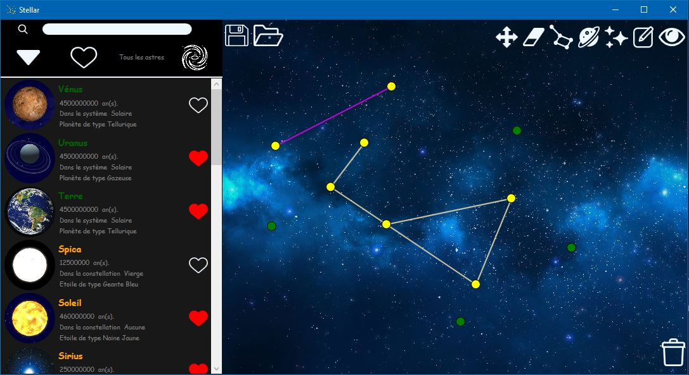
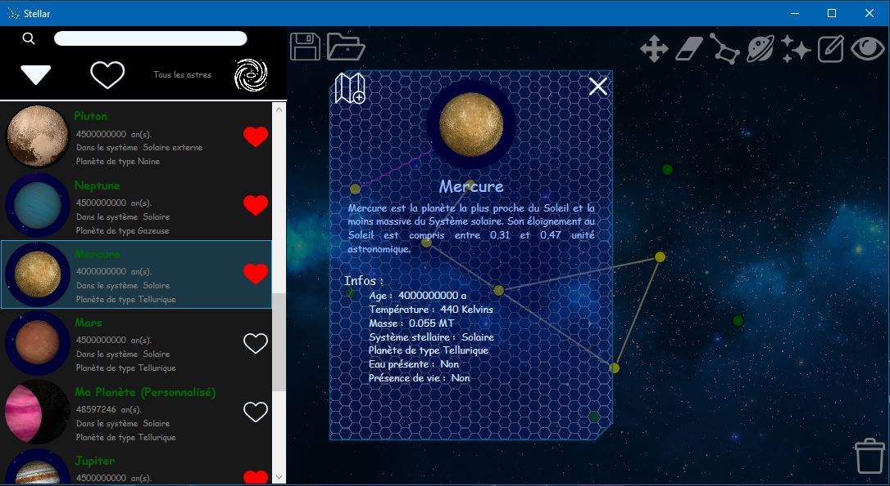

# Stellar

## Description

Cette application Stellar est un master-detail portant sur les astres (les étoiles et planètes de manière plus précise). Il est possible d'obtenir des informations sur ces objets stellaire, mais aussi de les mettre en favoris pour les retrouver plus facilement. L'application possède une partie "éditeur" dans laquelle l'utilisateur peut créer ses propres cartes du ciel, de manière interactive.  

  
*Capture d'écran du menu principal de Stellar. On retrouve le master à gauche et l'éditeur et ses outils à droite*

  
*Capture d'écran du détail d'une étoile depuis Stellar. La fenêtre est riche en informations à propos de l'astre sélectionné* 
    
## Eléments importants du code

- Nous avons la classe Constellation qui utilise des Points et des Segments. La méthode DiviserConstellation réalise un parcours en largeur afin de ne garder qu'une seule composante connexe dans *this*. 
- La classe Carte est assez bien découpée de notre Manager, et contient toutes les méthodes concernant les actions que peut effectuer l'utilisateur (relier, déplacer, effacer).
- Nous avons de l'héritage entre nos classes Astre, Etoile et Planete, ce qui nous permet de factoriser le code commun de ces classes.

## Description des ajouts personnels

- La partie "éditeur" de notre application est l'ajout principal de notre application. Cet éditeur se compose sous la forme d'une carte dans laquelle l'utilisateur peut effectuer diverses actions. Il peut ainsi créer ses propres étoiles et planètes, les disposer sur la carte, les modifier par la suite. Il peut les déplacer, les supprimer, et aussi relier les étoiles entre elles pour former des constellations. Enfin, il peut enregistrer ses cartes et les recharger par la suite pour continuer à travailler dessus.
Tous ces outils se trouvent dans la partie droite de l'application, sur la Carte.
- Concernant la partie "Master" de notre application, nous avons incorporé divers systèmes de tris et filtres afin de faciliter les recherches de l'utilisateur. Ces boutons et la barre de recherche sont visibles en haut de la partie gauche de l'application. 
- Enfin un système de favoris est présent, afin que l'utilisateur puisse enregistrer ses étoiles préférées afin de les retrouver plus facilement par la suite.
  
## Fonctionnalités

- [X] Il est possible de cliquer sur des astres de la partie gauche (partie master), afin d'obtenir des informations sur ceux-ci dans une fenêtre popup. 
- [X] Il est possible de trier et filtrer les astres via les divers boutons et la barre de recherche.
- [X] Les astres de la partie master peuvent être ajoutés ou retirés des favoris en cliquant sur le bouton "coeur".
- [X] Depuis la fenêtre popup, il est possible d'ajouter un astre à la carte en cliquant sur le bouton en haut à gauche puis en cliquant sur la carte. 
- [X] Il est aussi possible d'ajouter ses propres astres via les boutons "ajouter planète" et "ajouter etoile" depuis la carte.
- [X] Des étoiles peuvent être reliées via l'outil constellation. 
- [X] L'outil "déplacer" permet de modifier la position d'un astre, en cliquant une première fois sur lui, puis une seconde fois à l'endroit où l'on veut le positionner. 
- [X] L'outil "gomme" permet d'effacer les constellations d'une étoile si elle en a, ou l'astre en question. 
- [X] Le mode spectateur permet de voir la carte dans son ensemble.
- [X] Il est possible de tout effacer en cliquant sur la corbeille. 
- [X] On peut enregistrer la carte avec l'outil disquette, et ouvrir une carte avec l'outil dossier.

## Ergonomie / accessibilité

- [X] Des textes aparaissent au survol de la plupart des boutons pour spécifier leur rôle.
- [X] Des raccourcis claviers peuvent être utilisés pour activer les outils de la carte.
- [X] Il est possible de changer de boîte de dialogue en appuyant sur "tab" lors de la création ou modification d'un astre.
- [X] La barre de recherche ne tient pas compte de la casse des lettres majuscules / minuscules.
- [X] Le nom des astres sur la carte s'affiche lorsqu'on survole les points avec le curseur.  

## Comment lancer l'appli

Deux méthodes existent pour lancer l'appli.
- Avec visual :
	- Ouvrir le fichier "Modele.sln" dans le dossier trunk\source\Modele.
	- Sélectionner "Appli" en tant que projet de démarrage, et générer le projet.
	- Visual demande de redémarrer avec d'autres informations d'identification, accepter, il redémarre.
	- Refaire la deuxième manoeuvre, et l'application devrait se lancer.
- Avec le setup :
	- Executer le fichier "StellarSetup.msi" dans le dossier trunk\source\Modele\StellarSetup\Release
	- Suivre les étapes lors de l'installation.
	- Ouvrir l'application en cliquant sur l'icône qui a dû apparaître sur le bureau. L'application devrait demander les droits pour enregistrer les données, accepter. L'application devrait fonctionner.

## Informations générales

Projet réalisé en première année de DUT informatique, en binôme. J'étais avec Ulysse-Néo LARTIGAUD.
Merci à Nicolas RAYMOND, notre enseignant, qui nous a aidé durant ce projet.
